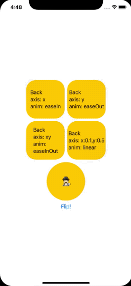

# MGFlipView


## About

If you are looking for easy way of implement 3D flip view, you are in right place. MGFlipView allows to create flip view in easy way without worring about flip animation and flip logic. 

The library is written in SwiftUI and it can be used on all platforms (iOS, macOS, watchOS, tvOS). 

Examples of usage for all platforms are avaialble after opening `MGFlipView.xcworkspace`.

The library is distributed via SPM.

## Preview



## Documentation

`FlipView` takes 5 arguments:

| Argument  | Type                   | Description  |
| --------- |:----------------------:| ------------ |
| frontView | `() -> View`           | Front view builder. Visible if flipped == true. |
| backView  | `() -> View`           | Back view builder. Visible if flipped == false. |
| flipped   | `Binding<Bool>`        | Binding which gives possiblity to flip the view. |
| flipAxis  | `FlipAxis`             | Rotation axis. `FlipAxis` have 4 defined values(`x`, `y`, `xy`, `custom(x: Double, y: Double)`). The custom value gives possiblity to declare your own axis. It has `x` default value when argument is not passed to the FlipView initializer. |
| animation | `AnimationDescription` | Defines the animation that takes place when flipping. Animation can be customized by setting duration and timing function (`linear`, `easeIn`, `easeOut`, `easeInOut`). It has `.init(type: .linear, duration: 0.25)` default value when argument is not passed to the FlipView initializer. |

```swift
public init(@ViewBuilder frontView: @escaping () -> ContentFront,
            @ViewBuilder backView: @escaping () -> ContentBack,
                         flipped: Binding<Bool>,
                         flipAxis: FlipAxis = .x,
                         animation: AnimationDescription = .default) {
```

## Installation

Use `https://github.com/Zaprogramiacz/MGFlipView.git` link to add Swift Package to Xcode project

## License

[MIT License](LICENSE)

Copyright (c) 2020 Maciej Gomółka
